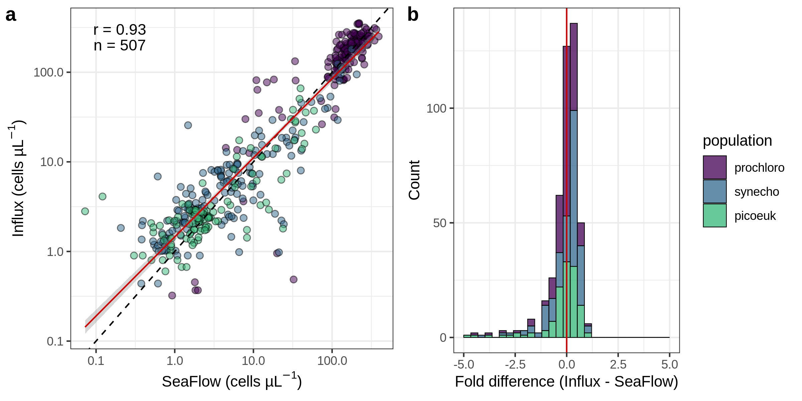

# Calibration of the Virtual Core to determine cell abundances
SeaFlow is an underway flow cytometer developed for continuous real-time observations of natural assemblages of small phytoplankton cells, including <i>Prochlorococcus</i>. Unlike other flow cytometers, SeaFlow does not use sheath fluid. Instead, a virtual core is used to determine the position of a particle in the stream of seawater ([Swalwell et al. 2011](https://doi.org/10.4319/lom.2011.9.466)). To determine cell abundances of different populations, the volume of the virtual core is first calculated by multiplying the volume of the detectable region (cross-sectional area within the stream where particles are detected by the laser) by the ratio of particles in the virtual core to total detectable particles. We evaluated the performance of the instrument on multiple cruises. Samples were collected for analysis by a BD Influx cell sorter and compared with samples analyzed with SeaFlow. Results are shown below.

Comparison of cell counts. a) Abundance of <i>Prochlorococcus</i>, <i>Synechococcus</i> and picoeukaryotes obtained with SeaFlow were compared with those obtained with a BD Influx flow cytometer. Note that samples analyzed with the Influx were not taken directly from the SeaFlow outflow and were fixed with 0.01\% glutaraldehyde, stored in liquid nitrogen, and analyzed with the Influx no later than 6 months after collection. Model I linear regression (red line), Pearson’s coefficient of correlation (r), number of observations (n), dash line representing the 1:1 slope are shown. b) Fold difference in abundance estimates between the the Influx and SeaFlow instruments.

***François Ribalet, Annette Hynes, Jarred Swalwell, Michael Carlson, Sophie Clayton, Gwenn Hennon, Rhonda Morales, Camille Poirier, Eric Shimabukuro and Alexandra Worden contributed to this project***
