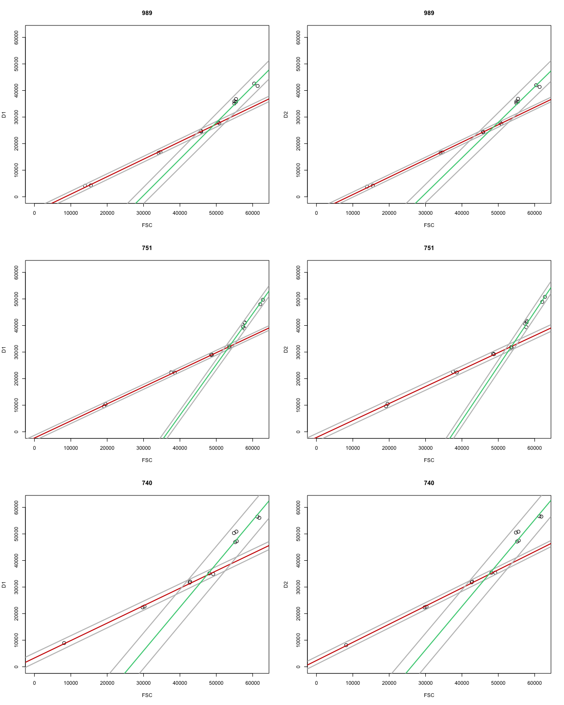

# seaflow-virtualcore
Coordinates of optimally positioned particles for the three SeaFlow instruments (#989, #751 and #740) using beads of various sizes.
Blue line represents the linear regression for small particles, green line for large particles.
Grey lines represents the 95% IC.

### François Ribalet, Jarred Swalwell, Rhonda Morales, Sophie Clayton, Camille Poirier and Alexandra Worden contributed to this project ###
